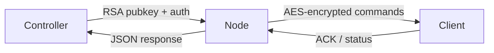
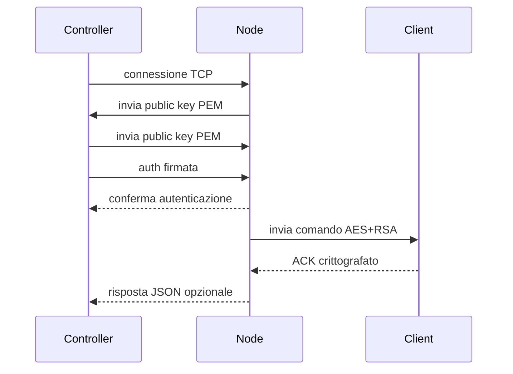

# pyBotnet

## 📌 Panoramica

`pyBotnet` è un progetto Python organizzato in tre componenti principali:

- `controller/`: console di controllo per gestire nodi e inviare comandi.
- `node/`: server che autentica il controller, gestisce client e inoltra istruzioni.
- `client/`: agente che si collega al nodo, riceve comandi crittografati ed esegue azioni di rete.

> Questo repository è destinato all'analisi del codice. L'esecuzione in ambienti non autorizzati può violare leggi o policy.

## 🧩 Architettura



## 🧱 Struttura del progetto

- `client/`
  - `main.py` - avvia il client.
  - `core/connect.py` - connessione sicura al nodo e ciclo comandi.
  - `core/crypto.py` - funzioni RSA/AES per il client.
  - `core/layers.py` - metodi di generazione traffico L7/L4/L3.
  - `core/utilities.py` - parsing URL, whitelisting IP e utilità di rete.

- `controller/`
  - `main.py` - carica i nodi e avvia la shell interattiva.
  - `core/connect.py` - connessione ai nodi, autenticazione e invio messaggi.
  - `core/crypto.py` - gestione chiavi RSA e firma messaggi.
  - `core/logger.py` - logger colorato e uniforme.
  - `core/errors.py` - eccezioni globali.
  - `core/shell.py` - shell interattiva con comandi e autocomplete.
  - `core/banners.json` - banner testuali per la shell.
  - `data/nodes.json` - elenco dei nodi di destinazione.

- `node/`
  - `main.py` - carica la configurazione e avvia il server.
  - `core/server.py` - logica di connessione, autenticazione e forwarding.
  - `core/crypto.py` - crittografia del nodo.
  - `core/logger.py` - logger del nodo.
  - `core/errors.py` - eccezioni del nodo.
  - `data/config.json` - impostazioni runtime.
  - `data/nodes.network` - nodi sincronizzati.

- `requirements.txt` - dipendenze python.
- `LICENSE` - licenza del progetto (GNU GPL v3).

## 🔗 Flusso dati



## ⚙️ Configurazione

### Controller

`controller/data/nodes.json`

```json
[
  ["127.0.0.1", 547]
]
```

### Nodo

`node/data/config.json`

- `address.host` - indirizzo di bind.
- `address.port` - porta TCP.
- `clients.max_clients` - massimo numero di client.
- `clients.client_overflow_sleep_s` - intervallo di attesa per overflow.
- `debug` - abilita logging dettagliato.

Esempio:

```json
{
  "address": {
    "host": "0.0.0.0",
    "port": 547
  },
  "clients": {
    "max_clients": 25,
    "client_overflow_sleep_s": 3600
  },
  "debug": false
}
```

## 🛠️ Installazione

```bash
python3 -m pip install -r requirements.txt
```

Dipendenze principali:

- `cryptography`
- `colorama`
- `scapy`

## 🔐 Chiavi e autenticazione

### Controller

Il controller genera automaticamente le chiavi RSA in `controller/data/keys/` se non esistono:

- `pub.key`
- `priv.key`

### Nodo

Il nodo richiede la chiave pubblica del controller in `node/data/keys/pub.key`.
Copia la chiave pubblica generata dal controller nel nodo:

```bash
mkdir -p node/data/keys
cp controller/data/keys/pub.key node/data/keys/pub.key
```

Senza questa chiave, il nodo non potrà autenticare il controller.

## ▶️ Esecuzione

### Avviare un nodo

```bash
cd /workspaces/pyBotnet/node
python3 main.py
```

### Avviare il controller

```bash
cd /workspaces/pyBotnet/controller
python3 main.py
```

### Avviare un client

```bash
cd /workspaces/pyBotnet/client
python3 main.py
```

Il client predefinito si connette a `127.0.0.1:547`.

## 🧠 Comandi del controller

- `help [command]` — mostra i comandi.
- `quit` / `exit` — esce dalla shell.
- `ping` — ping a tutti i nodi connessi.
- `nodes list` — elenca i nodi connessi.
- `nodes status` — verifica lo stato dei nodi.
- `nodes sync` — sincronizza la lista dei nodi.
- `nodes disconnect <node_id>` — disconnette un nodo.
- `clients list` — elenca i client noti dai nodi.
- `clients disconnect <node_id> <client_id>` — disconnette un client.
- `flood <url> [duration] [method] [threads]` — invia un comando di attacco.
- `methods` — mostra i metodi supportati.
- `! <command>` — esegue un comando shell (solo admin).

## 🌐 Metodi flood supportati

- Layer 7: `GET`, `POST`, `PUT`, `DELETE`, `HEAD`, `DNS`
- Layer 4: `ACK`, `SYN`, `FIN`, `RST`, `TCP`, `UDP`
- Layer 3: `ICMP`

## 🔧 Comportamento del nodo

- invia la sua chiave pubblica a ogni connessione.
- verifica la firma del controller.
- gestisce comandi di controllo: `status`, `sync_nodes`, `get_clients`, `disconnect_client`.
- inoltra altri messaggi verso i client con AES.
- se il limite di client è superato, invia `wait` o `redirect`.

`node/data/nodes.network` contiene i nodi sincronizzati.

## 🚀 Comportamento del client

- si connette al nodo configurato.
- riceve la chiave pubblica del nodo.
- invia la propria chiave pubblica.
- invia il messaggio iniziale di identificazione.
- riceve e decripta comandi AES.
- gestisce i comandi:
  - `flood` — esegue traffico di rete.
  - `redirect` — si riconnette a un altro nodo.
  - `wait` — attende e si riconnette.

## 🧪 Protocollo di comunicazione

- i messaggi hanno un prefisso a 2 byte con la lunghezza.
- le chiavi pubbliche sono in PEM.
- le sessioni AES sono cifrate con RSA.
- i comandi sono payload JSON.

## ⚠️ Avvertenze

- il nodo richiede `node/data/keys/pub.key` per autenticare il controller.
- `scapy` può richiedere permessi di root per operazioni raw.
- il client evita IP riservati e loop su reti interne.

## 📄 Licenza

Questo progetto è distribuito sotto la licenza **GNU General Public License v3**.
Consulta il file `LICENSE` per il testo completo.

## 📌 Note finali

- `controller/data/nodes.json` definisce i nodi target.
- `node/data/config.json` definisce il runtime del nodo.
- `node/data/nodes.network` memorizza i nodi sincronizzati.
- `controller/data/keys/` viene creato automaticamente dal controller.
